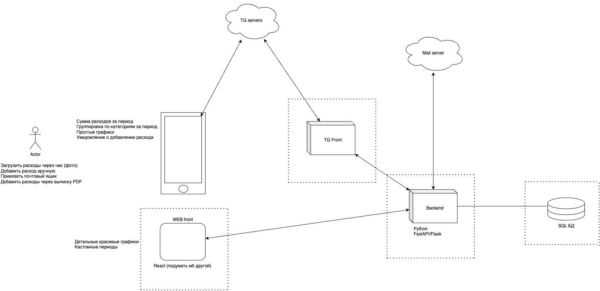

# Система учета расходов




# TODO
 - Реализовать MVP Backend с FastAPI
 - Реализовать MVP TG Frontend с python-telegram-bot
 - Определить схему MVP БД
 - Запихнуть все в Docker (+ docker-compose)


 ## Список user stories по возрастанию сложности:
 - Приветствие нового юзера
 - Добавление расходов вручную в чате
 - Просмотр расходов
    - по разным периодам
    - по категориям
 - Регулярные уведомления о суммарных расходах
 - Добавление расходов через QR-код чека
 - Вывод простых графиков в тг чат
 - Привязка почты для автоматического сбора чеков
    - Уведомления в тг о новом расходе
 - Другие, более сложные источники для расходов (распознавание текста на чеке, пдф выписки)


# Как начать разрабатывать

Использовать pyenv:

Установить Python 3.11.9
```bash
$ pyenv install 3.11.9
```

Создать и активировать виртуальное окружение
```bash
$ pyenv virtualenv 3.11.9 finance
$ pyenv local finance
$ pyenv activate finance
```

Установить зависимости
```bash
pip install -r requirements.txt
```
